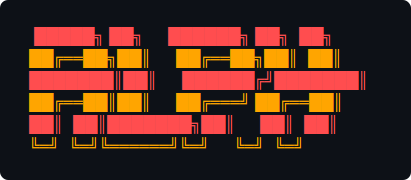

<p align="center">
  
</p>

## Overview

`alph` is a Node.js/TypeScript CLI tool that provides frictionless installation through NPM for managing MCP server configurations across multiple AI agents. It addresses user adoption barriers through the familiar NPM ecosystem while maintaining robust functionality.

## Demo


## Features

- 🚀 **Easy Installation**: Install globally via NPM without security warnings
- 🔧 **Multi-Agent Support**: Automatically detects and configures multiple AI agents
- 🛡️ **Safe Operations**: Atomic file operations with automatic backup creation
- 🌍 **Cross-Platform**: Works on Windows, macOS, and Linux
- 📦 **Stateless**: No network requests, operates entirely on local files
- 🔄 **Rollback Support**: Easy recovery from configuration issues

### Supported AI Agents

- **Gemini CLI** (`~/.gemini/settings.json`)
- **Cursor** (platform-specific configuration locations)
- **Claude Code** (Claude-specific configuration format)
- **Generic Provider** (custom configuration files)

## Installation

```bash
npm install -g @aqualia/alph-cli
```

### Requirements

- Node.js 18.0.0 or higher
- NPM (comes with Node.js)

## Usage

Alph now uses a subcommand-based CLI.

### Quick start (interactive)

```bash
# Launch the wizard to detect agents and guide you through setup
alph

# or explicitly run setup (no options launches the wizard)
alph setup
```

### Setup (non-interactive)

```bash
# Configure detected agents with an Async.link MCP endpoint (with bearer token)
alph setup \
  --mcp-server-endpoint https://askhuman.net/mcp/<server-id> \
  --bearer your-access-token

# Filter to specific agents
alph setup \
  --mcp-server-endpoint https://askhuman.net/mcp/<server-id> \
  --agents gemini,cursor \


# Dry-run preview (no file changes)
alph setup \
  --mcp-server-endpoint https://askhuman.net/mcp/<server-id> \
  --bearer your-access-token \
  --agents gemini,cursor \
  --dry-run
```

### Status

```bash
# Show detected agents and configured MCP servers
alph status
```

### Command reference

```text
alph setup [options]
      --mcp-server-endpoint <url>   MCP server endpoint URL
      --bearer [token]              Authentication token for Authorization (optional, redacted in output)
      --transport <type>            Transport protocol (http|sse|stdio)
      --command <cmd>               Command to execute for stdio transport
      --cwd <path>                  Working directory for command execution
      --args <list>                 Comma-separated arguments for command execution
      --env <list>                  Environment variables (key=value pairs)
      --headers <list>              HTTP headers (key=value pairs)
      --timeout <ms>                Command execution timeout in milliseconds
      --agents <list>               Comma-separated agent names to filter
      --dir <path>                  Custom config directory (default: use global agent config locations)
      --dry-run                     Preview changes without writing
      --name <id>                   Name/ID for the MCP server (optional)

alph status

alph remove [options]
      --server-name <name>          MCP server name to remove
      --agents <list>               Comma-separated agent names to filter
      --dir <path>                  Custom config directory (default: use global agent config locations)
      --dry-run                     Preview changes without removing
  -y, --yes                         Skip confirmation prompt
  -i, --interactive                 Launch interactive removal wizard
      --no-backup                   Do not create backups before removal (advanced)
```


## How It Works

1. **Detection**: Automatically scans for supported AI agent installations
2. **Backup**: Creates timestamped backups of existing configuration files
3. **Configuration**: Safely injects MCP server settings into agent configurations
4. **Validation**: Verifies configuration integrity after modifications
5. **Rollback**: Provides easy recovery if issues occur

## Configuration Details

### Gemini CLI

Modifies `~/.gemini/settings.json` to add MCP server configuration:

```json
{
  "mcpServers": {
    "your-server-id": {
      "httpUrl": "https://askhuman.net/mcp/your-server-id"
    }
  }
}
```

### Cursor

Updates Cursor's configuration with MCP server details in the appropriate platform-specific location.

### Claude Code

Integrates MCP server settings into Claude's configuration format.

## Safety Features

- **Atomic Operations**: All file modifications use atomic write operations
- **Automatic Backups**: Timestamped backups created before changes (can be disabled for removals with `--no-backup`)
- **Validation**: Configuration integrity verified after modifications
- **Error Recovery**: Clear error messages and rollback instructions
- **No Network Calls**: Operates entirely on local files for security

## Documentation

- [ARCHITECTURE.md](./ARCHITECTURE.md) — codebase structure and execution flows
- [SECURITY.md](./SECURITY.md) — security model, secret handling, backups/rollback
- [USER_GUIDE.md](./USER_GUIDE.md) — usage examples and command reference
- [TROUBLESHOOTING.md](./TROUBLESHOOTING.md) — common issues and resolutions

## Development

### Building from Source

```bash
git clone https://github.com/Aqualia/Alph.git
cd Alph
npm install
npm run build
```

### Running Tests

```bash
npm test                # Run all tests
npm run test:coverage   # Run tests with coverage
npm run test:watch      # Run tests in watch mode
```

### Development Scripts

```bash
npm run dev            # Build in watch mode
npm run lint           # Run ESLint
npm run lint:fix       # Fix ESLint issues
npm run format         # Format code with Prettier
npm run typecheck      # Run TypeScript type checking
```

## Troubleshooting

### Common Issues

**Command not found after installation**
```bash
# Ensure NPM global bin directory is in your PATH
npm config get prefix
# Add the bin directory to your PATH if needed
```

**Permission errors**
```bash
# On macOS/Linux, you might need to fix NPM permissions
sudo chown -R $(whoami) $(npm config get prefix)/{lib/node_modules,bin,share}
```

**Configuration file not found**
- Ensure your AI agent is properly installed
- Check that configuration files exist in expected locations
- Use the generic provider for custom installation paths

### Getting Help

- Check the [GitHub Issues](https://github.com/Aqualia/Alph/issues)
- Review the [troubleshooting guide](https://github.com/Aqualia/Alph/blob/main/TROUBLESHOOTING.md)
- Run `alph --help` for command-line help

## Alternative Installation Methods (roadmap)

NPM global install is the supported method today. Additional options under consideration:

1. **Package Managers**: Future support (e.g., Homebrew, Winget, Chocolatey)

## Contributing

We welcome contributions! Please see [CONTRIBUTING.md](CONTRIBUTING.md) for guidelines.

## License

MIT License - see [LICENSE](LICENSE) file for details.


